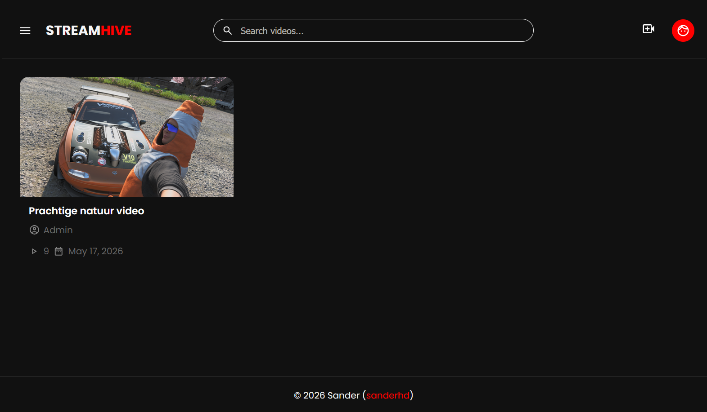

# StreamHive

<p align="center">
  
</p>

<p align="center">
  A modern video sharing platform inspired by YouTube.
</p>

<p align="center">
  
  
</p>

---

## Features

- Video uploads
- Like & comment system
- User authentication
- Goole OAuth Login
- Custom video player
- Categories
- Responsive UI

---

## Preview



---

## Tech Stack

- PHP
- MySQL
- JavaScript
- SCSS

---

## Installation

### Windows:
I'm using XAMPP for running MySQL and Apache, but you can use anything you prefer, this is a guide how to install it using XAMPP.

1. Install XAMPP:
Go to [XAMPP Installation](https://www.apachefriends.org/download.html), and download & install the latest version.

2. Navigate to HTDOCS folder:
Navigate to the `htdocs` folder, mine is at: `C:\xampp\htdocs`.

3. Clone the repository:
```bash
git clone https://github.com/sanderhd/StreamHive.git
cd StreamHive
```

4. Importing the Database:
In XAMPP, start MySQL, and press on `Admin`, this will open the PHPMyAdmin interface in your browser.
Create a database with the name `streamhive`, navigate to the `Import` tab, and upload the `db.sql` file, and press import.

5. Installing Composer Dependencies:
Navigate to the root directory: `/streamhive`
Run: 
```bash
composer install
```
This will install all the files that are needed for the Google Authentication System.

6. Edit the config:
Navigate to `/config/`
Run 
```bash
Windows (CMD):
copy Config.example.php Config.php

Windows (PowerShell):
Copy-Item Config.example.php Config.php
```
Edit the config to use your database, [CAPTCHA](https://www.cloudflare.com/products/turnstile/), Google Project Keys, and if you are using [Umami](https://umami.is/), your Umami variables.

7. Open the site:
Open your browser and go to:
[http://localhost/StreamHive/](http://localhost/StreamHive/)


### Linux (Ubuntu/Debian):

1. Install packages:
Update your package list and install Apache, MySQL, PHP, Composer and the required PHP extensions:

```bash
sudo apt update

sudo apt install -y \
    apache2 \
    mysql-server \
    php \
    php-mysql \
    php-curl \
    php-mbstring \
    php-xml \
    php-zip \
    composer \
    git
```

2. Clone the repository:
Navigate to your web directory and clone the repository:

```bash
cd /var/www/html

sudo git clone https://github.com/sanderhd/StreamHive.git

cd StreamHive
```

3. Import the database:
Start MySQL if it is not already running:

```bash
sudo systemctl start mysql
```

Create the database:

```bash
sudo mysql 
```

```sql
CREATE DATABASE streamhive;
EXIT;
```

Import the database schema:

```bash
mysql -u root -p streamhive < db.sql
```

4. Install Composer dependencies:
From the project root:

```bash
composer install
```

5. Configure the website

Navigate to the config directory and create the configuration file:

```bash
cp config/Config.example.php config/Config.php
```

Edit the file:

```bash
nano config/Config.php
```

Update:

- Database credentials
- Cloudflare Turnstile keys
- Google OAuth credentials
- Umami configuration (optional)

6. Permissions:

Make sure Apache can access the project files:

```bash
sudo chown -R www-data:www-data /var/www/html/StreamHive
sudo chmod -R 755 /var/www/html/StreamHive
```

7. Configure Apache:

```bash
sudo nano /etc/apache2/sites-available/streamhive.conf
```

Example configuration:

```apache
<VirtualHost *:80>
    ServerName localhost
    DocumentRoot /var/www/html/StreamHive

    <Directory /var/www/html/StreamHive>
        AllowOverride All
        Require all granted
    </Directory>
</VirtualHost>
```

Enable the site and rewrite module:

```bash
sudo a2enmod rewrite
sudo a2ensite streamhive.conf
sudo systemctl reload apache2
```

8. Open the website:

Open your browser and navigate to:
```
http://SERVER_IP/streamhive
```